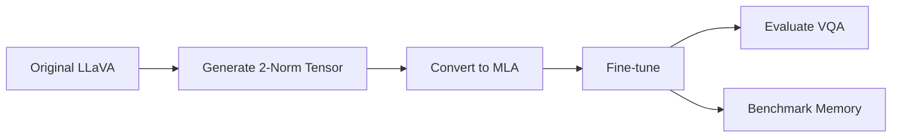

<p align="center">
  <h1 align="center">VLM-MLA</h1>
  <h3 align="center">Efficient Vision-Language Model via Multi-head Latent Attention</h3>
</p>

<p align="center">
  
  
  
  
</p>


---
## Introduction
This project implements **Multi-head Latent Attention (MLA)** for Vision-Language Models (VLMs), specifically for LLaVA models. By replacing standard Multi-Head Attention (MHA) with MLA, we significantly reduce KV cache memory overhead while maintaining competitive model performance.

> This project is based on the MHA2MLA conversion method from [Towards Economical Inference: Enabling DeepSeek's Multi-Head Latent Attention in Any Transformer-based LLMs](https://arxiv.org/pdf/2502.14837)

---

## Experiment Results

### Main Results: Memory-Accuracy Trade-off

Evaluated on **VQAv2 validation set** with sequence length = 2048, batch size = 1.

| Latent Dim (r) | RoPE Dim (r<sub>RoPE</sub>) | Weights (MB) | Peak (MB) | KV (MB) | KV Reduction | VQA Acc. |
|:--------------:|:---------------------------:|:------------:|:---------:|:-------:|:------------:|:--------:|
| — | — | 13,472 | 14,843 | 1,370 | — | 74.33% |
| 64 | 64 | 13,216 | 13,903 | 686 | -49.9% | 71.47% |
| **32** | **32** | **12,384** | **12,729** | **345** | **-74.9%** | **70.23%** |
| 32 | 16 | 12,311 | 12,573 | 262 | -80.9% | 68.23% |
| 16 | 32 | 12,040 | 12,306 | 265 | -80.7% | 50.63% |
| 16 | 16 | 11,936 | 12,167 | 231 | -83.2% | 27.00% |

> **Recommended setting**: `r=32, r_RoPE=32` achieves **74.9% KV reduction** with only **4.1%** accuracy drop.

### Partial RoPE Strategy Comparison

Fixed settings: RoPE Dim = 64, Low-rank Dim = 64, **No Fine-tuning**.

| Strategy | VQA Accuracy |
|:--------:|:------------:|
| High | 48.90% |
| Low | 36.37% |
| Uniform | 69.77% |
| **2-norm** | **70.73%** |

> The **2-norm** strategy consistently outperforms other partial RoPE selection methods.

---

## Installation

```bash
# Clone the repository
git clone https://github.com/bonginn/vlm-mla.git
cd vlm-mla

# Create conda environment
conda create -n vlm-mla python=3.10 -y
conda activate vlm-mla

# Install dependencies
pip install -r requirements.txt
```

### Download Dataset (Optional)

Required for 2-norm tensor generation or fine-tuning:

```bash
mkdir -p data/coco2017 && cd data/coco2017
wget http://images.cocodataset.org/zips/train2017.zip
unzip train2017.zip && rm train2017.zip
cd ../..
```

### Converted and Fine-tuned Models

We provide pre-trained MLA-converted and fine-tuned models on [Hugging Face](https://huggingface.co/collections/bonginn/vlm-mla-models).
You can directly load these models without running the conversion and fine-tuning yourself.

---

## Usage

### Workflow Overview



### 1. Generate 2-Norm Rank Tensor (Optional)

```bash
python -m vlm_mla.generate_2norm \
    --model llava-hf/llava-1.5-7b-hf \
    --output_path ./llava-7b-2norm-rank.pth \
    --dataset liuhaotian/LLaVA-Instruct-150K \
    --image_root ./data/coco2017/train2017 \
    --sample_size 1024
```
> **Note**: If you plan to use the `2-norm` partial RoPE strategy, you must generate the 2-norm rank tensor **before** converting the model. 

### 2. Convert Model to MLA

```bash
python -m vlm_mla.convert \
    --model llava-hf/llava-1.5-7b-hf \
    --output_dir ./models/llava-7b-r32-rd32-2norm \
    --low_rank 32 \
    --rope_dim_for_mla 32 \
    --partial_rope_version 2-norm \
    --qk_tensor_path ./llava-7b-2norm-rank.pth
```

### 3. Fine-tune MLA Model

```bash 
python -m vlm_mla.train \
    --model_path ./models/llava-7b-r32-rd32-2norm \
    --data_path liuhaotian/LLaVA-Instruct-150K \
    --image_folder ./data/coco2017/train2017 \
    --output_dir llava-7b-r32-rd32-2norm-finetuned \
    --num_train_epochs 1 \
    --per_device_train_batch_size 8 \
    --gradient_accumulation_steps 2 \
    --learning_rate 2e-5 \
    --weight_decay 0.0 \
    --warmup_ratio 0.03 \
    --lr_scheduler_type cosine \
    --logging_steps 10 \
    --save_strategy steps \
    --save_steps 500 \
    --save_total_limit 3 \
    --bf16 True \
    --tf32 True \
    --dataloader_num_workers 4 \
    --gradient_checkpointing True \
    --optim adamw_torch \
    --report_to none \
    --sample_ratio 0.01
```
> **Note**: The `sample_ratio` parameter controls the percentage of training data used for fine-tuning. Based on the experiment results from the original [paper](https://arxiv.org/pdf/2502.14837), it only needs to be 1% of the total training data to achieve good performance.

### 4. Evaluate on VQAv2

```bash
python -m vlm_mla.eval_vqa \
    --model_path ./llava-7b-r32-rd32-2norm-finetuned \
    --split validation \
    --batch_size 8 \
    --max_new_tokens 32 \
    --output_dir ./eval_results
```

### 5. Benchmark Memory & Throughput

```bash
python -m vlm_mla.benchmark_memory \
    --baseline_model llava-hf/llava-1.5-7b-hf \
    --mla_model ./llava-7b-r32-rd32-2norm-finetuned \
    --image ./demo.jpg \
    --prompt "What is unusual about this image?" \
    --max_new_tokens 512 \
    --num_runs 5 \
    --batch_size 1
```

## Project Structure

```
vlm_mla/
├── convert.py               # MHA to MLA conversion
├── train.py                 # Fine-tuning script
├── eval_vqa.py              # VQAv2 evaluation
├── benchmark_memory.py      # Memory & throughput benchmark
├── generate.py              # Inference / text generation
├── generate_2norm.py        # 2-norm rank tensor generation
├── mha2mla_core.py          # Core conversion logic
├── patching_llama_compat.py # Attention forward patching
├── patch_model_load.py      # Model weight patching
├── patch_func.py            # Partial RoPE & SVD utilities
├── mla_cache.py             # MLA latent cache implementation
└── load.py                  # Model loading with MLA support
```

---

## TODO

- [ ] Implement optimized MLA kernel
- [ ] Integrate KV cache quantization
- [ ] Evaluate on additional benchmarks (TextVQA, GQA, etc.)
